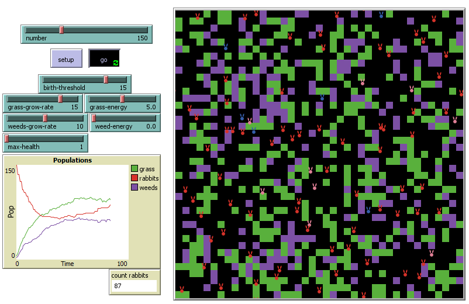
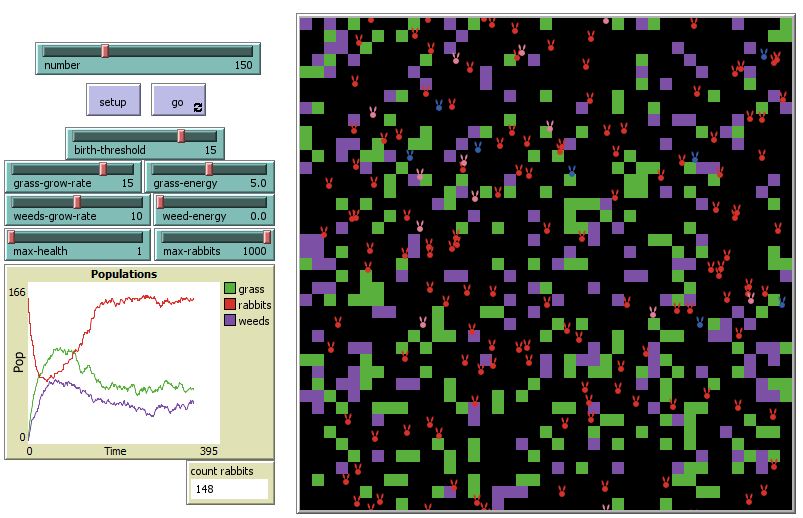
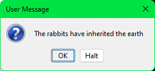
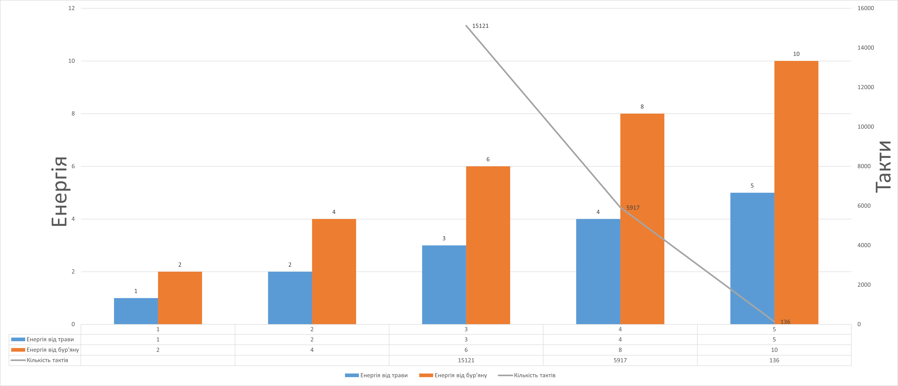

## Комп'ютерні системи імітаційного моделювання
## СПм-23-5, **Хромов Нікіта Олексійович**
### Лабораторна робота №**2**. Редагування імітаційних моделей у середовищі NetLogo

 

### Варіант 6, модель у середовищі NetLogo:
[Rabbits Grass Weeds](http://www.netlogoweb.org/launch#http://www.netlogoweb.org/assets/modelslib/Sample%20Models/Biology/Rabbits%20Grass%20Weeds.nlogo)
Додати можливість отруїтися при поїданні бур'янів (зазначена у внутрішніх параметрах, як певна вірогідність). Захворілий кролик не може харчуватися, переміщатися і розмножуватися, позначається іншим кольором і залишається хворим на 3 такти модельного часу. Додати поділ кроликів на самців та самок. Поява нових кроликів має вимагати не тільки ситості, а й здоров'я, та присутності в одній із сусідніх клітин іншого ситого здорового кролика протилежної статі. Поява потомства відбувається із ймовірністю 50%.
 

## Внесені зміни у вихідну логіку моделі, за варіантом:

### Додати можливість отруїтися при поїданні бур'янів (зазначена у внутрішніх параметрах, як певна вірогідність):

Змінив процедуру **eat-weeds** так, щоб кролики, котрі їдять бур'ян становилися червоними:
<pre>
to eat-weeds
if pcolor = violet
  [
      set color red
      set energy energy + weed-energy
   ]
end
</pre>
Для впливу на здоров'я додав змінну **health** у *rabbits-own*:
<pre>
rabbits-own [ energy health ]
</pre>
Та оновив процедуру **eat-weeds** так, щоб кролики втрачали здоров'я з деяким шансом під час поїдання бур'яну:
<pre>
to eat-weeds
  if pcolor = violet
  [
    ifelse random 3 = 1
    [
      set color red
      set health 0
      set pcolor black
    ]
    [
      set pcolor black
      set energy energy + weed-energy
    ]
  ]
end
</pre>
Та оновив процедуру **move** так, щоб після деякого часу кролики одужували:
<pre>
to move  ;; rabbit procedure
  ifelse health = 3
  [
    if color = red[set color white]
    rt random 50
    lt random 50
    fd 1
    set energy energy - 0.5
  ]
  [
    set health health + 1
  ]
end
</pre>

### Додати поділ кроликів на самців та самок
Для цієї зміни додав ще змінну у *rabbits-own*
<pre>
gender-m
</pre>

Та змінив логіку присудження кольору у **setup**:
<pre>
to setup
  clear-all
  grow-grass-and-weeds
  set-default-shape rabbits "rabbit"
  create-rabbits number [
    set health 3
    set gender-m one-of [ true false ]
    ifelse gender-m
  [ set color blue ]
  [ set color pink ]
    setxy random-xcor random-ycor
    set energy random 10  ;start with a random amt. of energy
  ]
  reset-ticks
end
</pre>

І замінив логіку присудження кольору у процедурі **move** щоб після одужання вони становилися кольору свого гендеру:
<pre>
to move  ;; rabbit procedure
  ifelse health = 3
  [
    if color = yellow
    [
      ifelse gender-m
        [ set color blue ]
        [ set color pink ]
    ]
    rt random 50
    lt random 50
    fd 1
    set energy energy - 0.5
  ]
  [
    set health health + 1
  ]
end
</pre>

Після цих змін модель під час симуляції виглядає наступним чином:

### Поява нових кроликів має вимагати не тільки ситості, а й здоров'я, та присутності в одній із сусідніх клітин іншого ситого здорового кролика протилежної статі. Поява потомства відбувається із ймовірністю 50%.
Змінив відповідну процедуру **reproduce**:

<pre>
to reproduce     ;; rabbit procedure
  if energy > birth-threshold and health = 3
  [
    if gender-m = true and any? rabbits in-radius 1 with [gender-m = false and health = 3 and energy > birth-threshold]
    [
      ;; male rabbits only lose energy
      set energy energy / 2
    ]
    if gender-m = false and any? rabbits in-radius 1 with [gender-m = true and health = 3 and energy > birth-threshold]
    [
      ;; female rabbits lose energy and give birth
      set energy energy / 2
      if one-of [ true false ] = true
      [
        hatch one-of [1 2] [
          set health 3
          set gender-m one-of [ true false ]
          ifelse gender-m
            [ set color blue ]
            [ set color pink ]
          setxy random-xcor random-ycor
          set energy random 10
          fd 1
        ]
      ]
    ]
  ]
end
</pre>

## Внесені зміни у вихідну логіку моделі, на власний розсуд:

### Зробив задання максимального здоров'я через повзунок:

Та замінив усі частини коду, де
<pre>
health = 3
</pre>
на
<pre>
health = max-health
</pre>

### Оптимізація моделі:
Додав повзунок **max-rabbits** для відстежування максимальної кількості кроликів, а у процедуру **go** додав логіку для відстежування:
<pre>
to go
  if count rabbits > max-rabbits [ user-message "The rabbits have inherited the earth" stop ]
  ...
end
</pre>

Після усіх змін модель виглядає наступним чином:

Вікно сигналізації кількості кроликів:

 

## Обчислювальний експеримент
### Вплив загальної кількості отримуємої енергії на швидкість захоплення світу кроликами
Досліджується вплив параметрів **weed-energy** та **grass-energy** на швидкість досягнення кількості кроликів максимального значення(500).
Інші керуючі параметри за замовчуванням:
- **number** – 150
- **birth-threshold** - встановлює рівень енергії, при досягненні якого кролики починають розмножуватися.
- **Grass-Growth-Rate** – регулює швидкість росту трави.
- **weeds-growth-rate** – керує темпом розвитку бур'янів.
- **grass-energy** – кількість енергії, що отримується від поїдання трави.
- **weed-energy** - енергія, що отримується від поїдання бур'янів.
<table>
<thead>
<tr><th>Енергія від трави</th><th>Енергія від бур'яну</th><th>Кількість тактів</th><th>Додатки</th></tr>
</thead>
<tbody>
<tr><td>1</td><td>2</td><td></td><td>У цьому випадку кролики так і не змогли досягти максимальної кількості, а продовжували жити у кількості 100-200 особин.</td></tr>
<tr><td>2</td><td>4</td><td></td><td>У цій симуляції коли кролики досягли кількості 241, залишилися лише особини жіночої статі(дуже рідкий випадок навіть у теорії) та не мали змоги розмножуватись.</td></tr>
<tr><td>3</td><td>6</td><td>15121</td><td>По проходженню 15121 тактів кількість кроликів переважила за відмітку 500 особин та симуляцію було зупинено.</td></tr>
<tr><td>4</td><td>8</td><td>5917</td><td>У цьому випадку знадобилося лише 5917 тактів для досягнення кількості в 500 особин.</td></tr>
<tr><td>5</td><td>10</td><td>136</td><td>Кількість кроликів становила 500 вже через 136 тактів після початку симуляції.</td></tr>
</tbody>
</table>

Висновок: Зі збільшенням енергії, яку кролики отримують від поїдання трави та бур'янів, значно зростає швидкість їх розмноження. Це призводить до швидшого досягнення максимальної кількості особин у моделі.